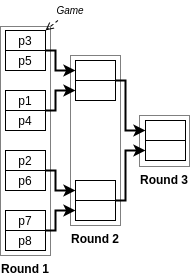
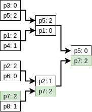

= Tournament Management Library

Simple Java library to create and manage simple single-elimination tournaments.
For instance, this library can be used to build the backend of a web application to manage tournaments.

== Single-elimination tournament?

A single-elimination tournament is a typical tree-shaped tournament where a  participant is eliminated from the tournament as soon as she or he loses a game.

For example, if we have 8 participants named _p1, p2, … p8_, then we can initialize the following tournament tree:



Each node in the tree is a game.
To win a game, a participant must have more points than the opponent.

For example, here is the same tournament but with all games completed, and with in green the history of _p7_'s results (who is the winner of the tournament):



Once a tournament is over, it is possible to obtain a partial ranking of the participants base on their results.
A participant has a better rank than another one if he or she loses in a later round.
If several participants lose in the same round, they are ex-æquo.

For instance, for the same tournament, the final ranking is the following one:

. _p7_
. _p5_
. _p1_, _p2_
. _p3_, _p4_, _p6_, _p8_

NOTE: This library only deals with tournaments where the number of participants is a power of two.

== Development

This project uses maven for dependency management and compilation.
To compile, just run:
```
mvn package
```

To generate the javadoc:
```
mvn site
```

The javadoc can then be found in `target/site/apidocs/`.

== Basic usage

The entry point of the library is the `Tournament` interface (with its implementation `TournamentImpl`), which defines all the main services.

To create an empty tournament:
```java
Tournament myTournament = new TournamentImpl();
```

To add participants:
```java
Participant p1 = new ParticipantImpl("p1");
Participant p2 = new ParticipantImpl("p2");
myTournament.addParticipant(p1);
myTournament.addParticipant(p2);
```

To start the tournament:
```java
myTournament.start();
```


Once a tournament has started, participants cannot be added, and results can be registered.

To get the next games that must be played:
```java
List<Game> nextGames = myTournament.getGamesReadyToStart();
Game game1 = nextGames.get(0); // here there is only one game
```

To start a game, add results, and finish a game:
```java
game1.start();
game1.addPoints(p1, 2);
game1.addPoints(p2, 0);
game1.finish();
```

When a game is finished, the winner gets added to the following game in the next round, if any (not shown in the example here).


== What this library does *not* do

- Does not deal with tournaments that have a number of participants that is not a power of two, therefore does not deal with _byes_.
- Does not automatically manage _seeds_ for participants.