= Tournament Management Test Project Report

== Analyse de la testabilité

* Ajout de méthode getPoints() et setStatus() dans game pour des raisons d'observabilité et de contrôlabilité, respectivement.
* La méthode buildAllRounds avait un défaut, causé par l'utilisation de la méthode List::clear(). La solution a été de changer le code est de réinstancier une liste temporaire au lieu de la vider à chaque itération (voir code).
* La méthode start() instancie elle même un TournamentTreeBuilder à chaque appel, ce qui cause des problèmes de contrôlabilité. La solution a été de passer la responsabilité de cette instanciation en paramètre. Changement de la signature de Tournament::start() vers Tournament::start(TournamentTreeBuilder)

== Application d'une méthode fonctionnelle

=== Game::addPoints(Participant participant, int points)

Entrées :

* this.status
* participant
* points

Sorties :

* this.participants
* TournamentException
* IllegalArgumentException

Caractéristiques :

* participant : [null] ~a1~ [=/= null] ~a2~
* points : [p<0] ~b1~    [p = 0] ~b2~     [p > 0] ~b3~
* this.status : [INPROGRESS] ~b1~          [=/= INPROGRESS] ~b2~

Multiple Base Choice Coverage (a2, b3, c1) & (a2, b1, c1):

(a2, b3, c1) : Le cas où on souhaite ajouter un nombre de points à un adversaire existant de la partie en cours. C’est le cas le plus courant.

(a2, b1, c1) : Le cas où on souhaite retirer un nombre de points à un adversaire existant de la partie en cours. Bien que moins courant que le cas précédent, c’est aussi une possibilité non négligeable dans des cas d’arbitrage, d’erreur humaine lors du renseignement des scores, ou tout simplement de jeu ou il est possible de perdre des points au cours d’une partie.

Suite de tests :

* (a2, b3, c1) : addPointsProperlyAddsPositiveAmountOfPoints
** oracle : addPoints() doesn’t throw error, players have the proper amount of points

* (a1, b3, c1) : addPointsThrowsErrorWhenPlayerIsNull
** oracle : IllegalArgumentException

* (a2, b1, c1)* : addPointsProperlyAddsNegativeAmountOfPoints
** oracle : addPoints() doesn’t throw error, players have the proper amount of points

* (a2, b2, c1) : addPointsProperlyAddsPositiveAmountOfPoints (This test was redundant with (a2, b3, c1) and was implemented with it as a result)
** oracle : addPoints() doesn’t throw error, players have the proper amount of points

* (a2, b3, c2) : addPointsThrowsErrorWhenGameIsNotInProgress
** oracle : TournamentException

* (a2, b1, c1) : addPointsProperlyAddsPositiveAmountOfPoints (*Mentioned above already)
** oracle : addPoints() doesn’t throw error, players have the proper amount of points

* (a1, b1, c1) : addPointsThrowsErrorWhenPlayerIsNull (This test was redundant with (a1, b3, c1) and was implemented with it as a result)
** oracle : IllegalArgumentException

* (a2, b1, c2) : addPointsThrowsErrorWhenGameIsNotInProgress (This test was redundant with (a1, b3, c1) and was implemented with it as a result)
** oracle : TournamentException

=== Tournament::start(TournamentTreeBuilder ttb)

Entrées :

* this.participants
* this.status
* ttb

Sorties :

* Void
* TournamentException

Caractéristiques :

* participants.length : [<2] ~a1~       [>= 2] ~a2~
* participants.length : [Power of 2] ~b1~       [not a Power of 2] ~b2~
* this.status : [NOTSTARTED] ~c1~     [INPROGRESS] ~c2~     [FINISHED] ~c3~

Base Choice Coverage (a2, b1, c1) : Le cas le plus classique, où on utilise cette fonction pour construire un arbre de tournoi de plus de 2 joueurs, avec un nombre en puissance de deux car c’est le seul cas géré par tournamentmanager, et où le tournoi n’a pas déjà été lancé.

* (a2, b1, c1) : testStartWithTwoOrMoreParticipantsInPowerOfTwo
** oracle: tournament is started, no error

* (a1, b1, c1) : testStartWithLessThanTwoParticipants
** oracle: TournamentException

* (a2, b2, c1) : testStartNumberOfParticipantsNotPowerOfTwo
** oracle: TournamentException

* (a2, b1, c2) : testStartWhenTournamentInProgress
** oracle: TournamentException

* (c2, b1, c3) : testStartWhenTournamentFinished
** oracle: TournamentException

== 3.4 Qualité des tests (a) : couverture du code

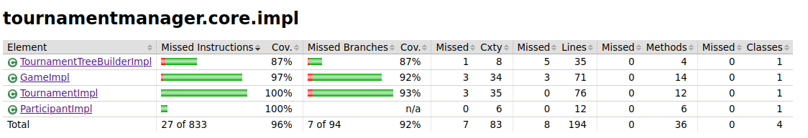
image::firstJacocoReports/screenparticipant.png[]
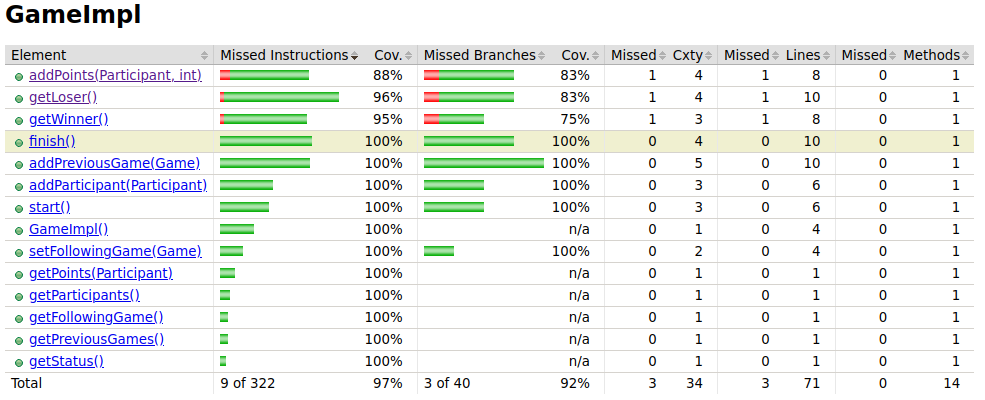
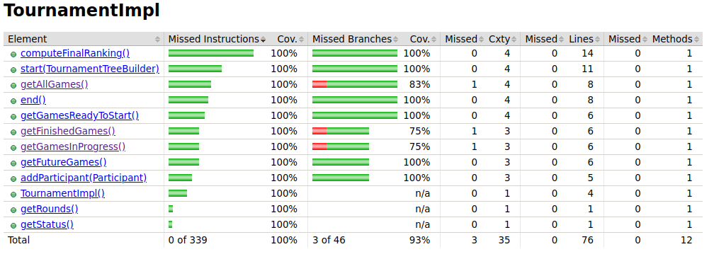
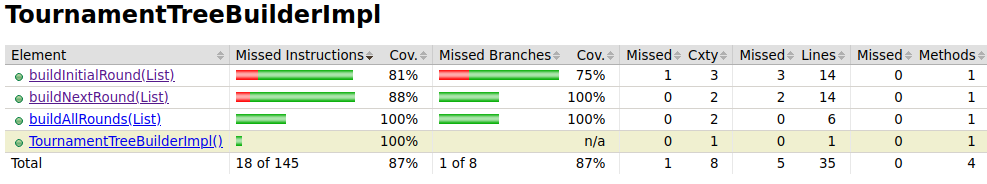

Les résultats obtenus sont relativement bons : la majorié du code est couverte, mais certaines parties de méthodes clés ne le sont pas, notamment buildInitialRound, buildNextRound

== 3.5 Applications d'une méthode structurelle

=== TournamentTreeBuilder::buildInitialRound

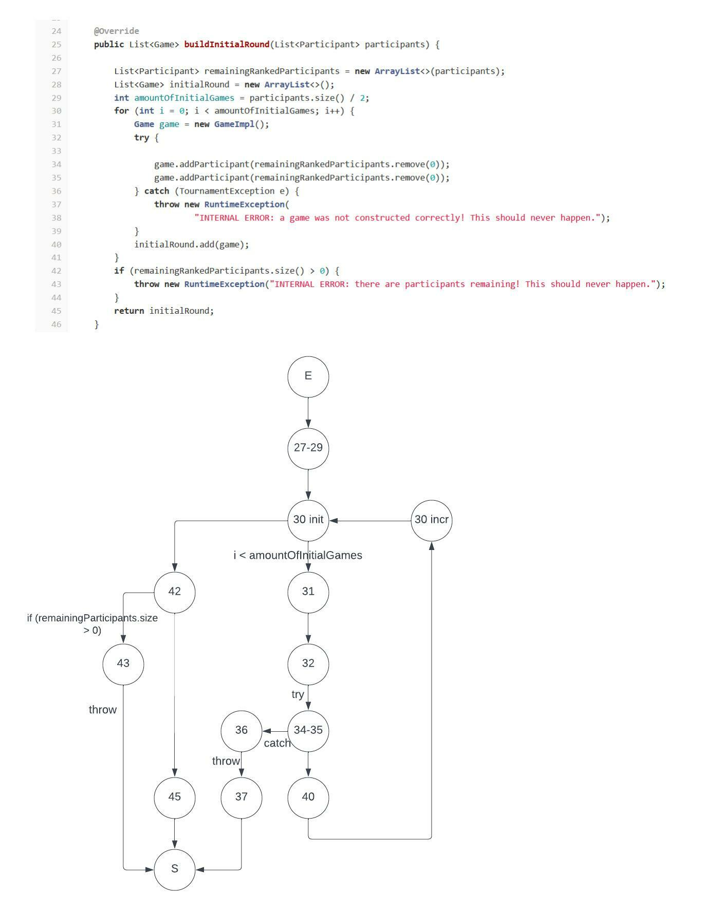

Tous les 1 chemins - Ce critère permet de parcourir tous les chemins au cours desquels buildInitialRound throw une erreur

. 27-29 -> 30 init -> 31 -> 32 -> 34-35 -> 40 -> 30 incr -> 30 init -> 42 -> 45 -> S
. 27-29 -> 30 init -> 31 -> 32 -> 34-35 -> 40 -> 30 incr -> 30 init -> 42 -> 43 -> S
. 27-29 -> 30 init -> 31 -> 32 -> 34-35 ->36 -> 37 -> S
. 27-29 -> 30 init -> 42 -> 43 -> S
. 27-29 -> 30 init -> 42 -> 45 -> S

Scénarios de test :

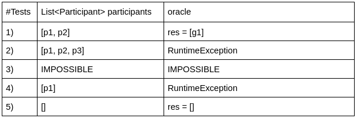

Le chemin 3. est irréalisable : quand addParticipant throw une erreur, alors la méthode de test qui l'a appellée s'arrête instantanément, avant que l'erreur soit catch et renvoie une RuntimeException

=== TournamentTreeBuilder::buildNextRound

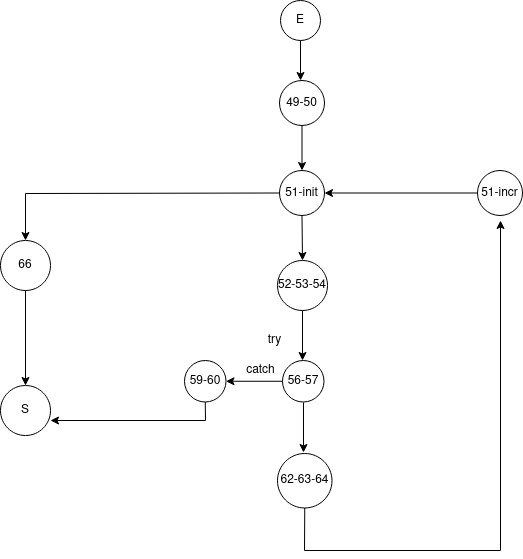

. E → 49-50 → 51-init → 52-53-54 →  56-57 →59-60 → S
. E → 49-50 → 51-init →52-53-54 →  56-57 → 62-63-64 → 51-incr → 66 → S
. E → 49-50 → 51-init → 66 → S

Scénarios de test :

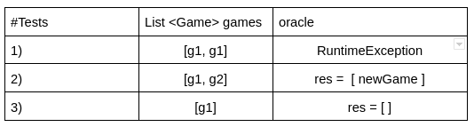

== 3.6 Qualité des tests (b): couverture du code _bis_

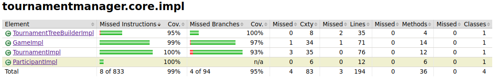
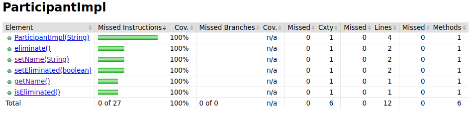
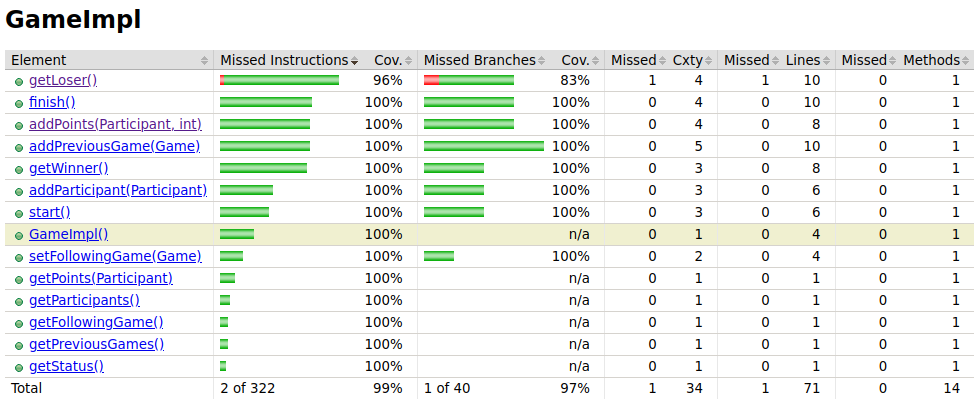
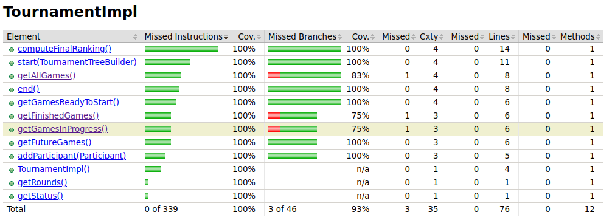
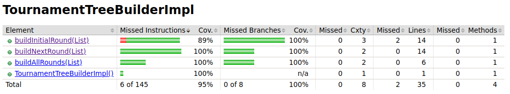

Les résultats sont évidemment meilleurs que précédemment. Les quelques cas toujours non couverts concernent des branches inatteignables.

La suite de test semble presque suffisante, mais elle contient encore quelques défauts, et l'analyse de mutation n'a pas encore été réalisée.

== 3.7 Qualité des tests (c): analyse de mutation

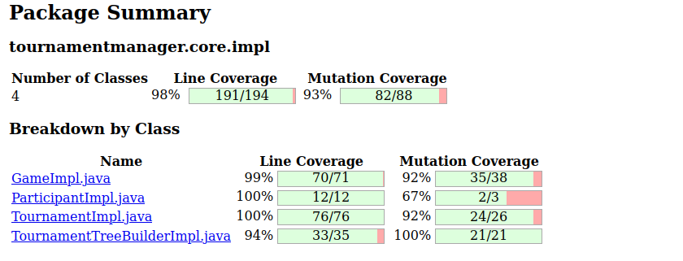

Un nombre non négligeable de mutants ont survécu; même si la couverture de mutation est globalement bonne. Il est intéressant de noter que la méthode fonctionnelle et la couverture de code suffisent quasiment entièrement à couvrir les mutations, même si ne sont pas leur objectif initial.

Même si c'est n'est pas absolument nécessaire étant donné le pourcentage déjà élevé de couverture, il est tout de même intéressant d'élargir la suite de test pour couvrir les mutations restantes, car elles concernent des classes essentielles au logiciel.

== 3.9 Qualité des tests (d): analyse de mutation _bis_

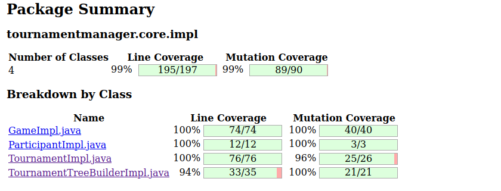

Les seuls cas restants sont des endroits de code inatteignable, ce qui nous donne une couverture presque totale.

La suite de tests semble suffisante.

== 3.10 Synthèse finale

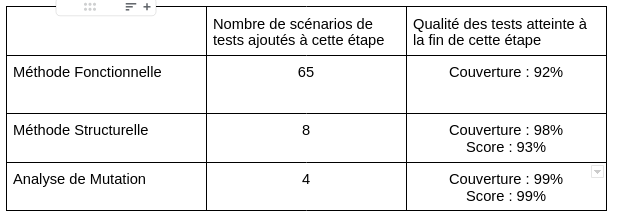

Pour conclure, ce projet nous a montré plusieurs choses :

* La création de tests doit être rigoureusement appliqués d'après les méthodes définies au préalable, sans quoi les scénarios de tests peuvent rapidement être chaotique et difficilement compréhensibles / réutilisables.

* L'ensemble des méthodes appliquées permettent d'obtenir une suite conséquente de tests, même si c'est laborieux. Il y'a presque autant de code pour les tests que pour le logiciel.

* Même si ce n'était peut-être pas le plus simple, le projet a été réalisé entièrement sans doublure de tests, même lorsque cela était possible.

* Aucun code n'est digne de confiance absolue.

